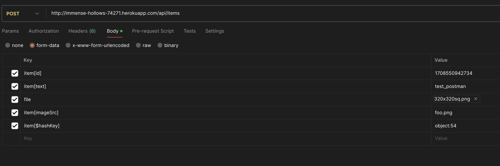

# Observed issues

## Bugs

### Editing an item's image is not working

*Description*

Text is being updated succesfully, but the image is not.

As per my investigation I believe this is related to the conditional used [here](https://github.com/mrios/angular-strangerlist/blob/master/server.js#L70), which would seem to always resolve to False since `imageSrc` is a property of `req.body`, not from `req`. The `text` field is not affected since the value of `req.body.item.text` is set for both cases.

*Steps to reproduce*

Please refer to test case 002.

----

### Typos in delete confirmation message

*Description*

Confirmation message says `Are you shure...` instead of `Are you sure...`. Besides that since the message is in English the opening question mark should not be used.

*Steps to reproduce*

Please refer to test case 003.

----

### Images from deleted items are not deleted from disk

*Description*

When an item is created the image is uploaded to the `/public/assets/images` directory. However, when the item is deleted the image still remains there. I understand this is due to the [implementation of the delete endpoint](https://github.com/mrios/angular-strangerlist/blob/master/server.js#L119) only removing the entry from the `items.json`, but not deleting the actual file.

*Steps to reproduce*

Please refer to test case 006.

----

#### Duplicate filenames are not handled properly

*Description*

Since image files seem to be uploaded directly to disk, uploading a file with a filename that already exists will overwrite the existing one. This means that the existing item will now be rendered with the image of the new item. Perhaps files could be renamed to use a uuid instead.

*Steps to reproduce*

Please refer to test-case 007.

----

### An item can be deleted while it's being edited, and clicking on edit will re-create the item

*Description*

This might not be a common scenario, but if it were to happen it could lead to db inconsistencies.
The delete operation can always be disabled while the item is under edition, or/and the API could return an error when trying to edit a no longer existing item.

*Steps to reproduce*

Please refer to test-case 008.

----

### Selected file is not cleared in the form after an item has been created

*Description*

After an item is created, the `Image` field of the `Item Details` keeps the file that was selected. This could lead to uploading a duplicated image by mistake, as you're not forced to select a new file. All fields in the form should likely be cleared if the item creation was succesful.

*Steps to reproduce*

Please refer to case 001. After click on `Create Item` check the content of the `Image` field.

----

### New item validations are only client-side

*Description*

The `/api/items` endpoint can be requested directly to create images without the frontend restrictions.
Suggested fix: The restrictions should either be replicated or moved to the endpoint level.

*Steps to reproduce*

Use postman or any tool of preference to do a post to `/api/items`. The network tab of the your browser's devtools can be used to inspect the required fields, but you can use the image below as a reference. The id needs to match the item you want to modify.

## Improvements

### Surfacing errors on Item upload

Regardless of the image size and text length indications, surfacing the exact error preventing the `Item Creation` button from being enabled would improve the user experience, and it would also help detect other unexpected errors without having to open the console (something an end user will rarely do).